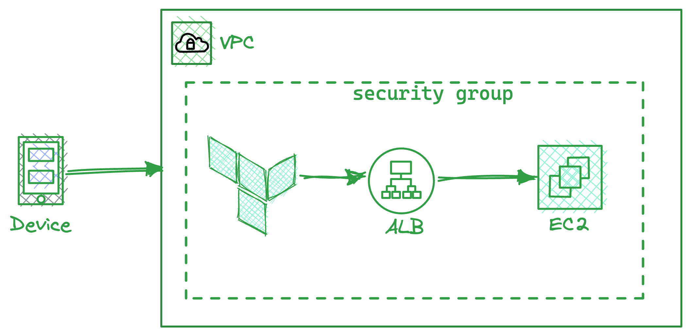

# Deploy EC2 instance with Load Balancer & Security Group using Terraform

[](#)

This repo contains, how to deploy an AWS EC2 instance, connected to a load balancer and a security group.

An EC2 instance is a virtual machine that runs on AWS infrastructure.

This project contains, how to use provider, resources, variables, outputs and modules of terraform.

## Architecture



## Deploying The Infra

First we need to initialize our infrastructure so that terraform can download the necessary provider and module.

`$ terraform init`

Next

`$ terraform plan`

The `terraform plan` command in Terraform creates an execution plan, which lets you preview the changes that Terraform plans to make to your infrastructure.

By default, when Terraform creates a plan it:

Lists all resources that will be created or modified.
Shows the changes that will be made to each resource.
Shows the resources that will be destroyed.
Next we need to provision our infrastructure

`$ terraform apply`

The `terraform apply` command applies the Terraform configuration to the target infrastructure.

This command creates, updates, or destroys infrastructure resources based on the current state of the Terraform configuration.

You will need to provide a vpc id and enter yes when the prompt will ask.

Finally, if you want to destroy your resource.

`terraform destroy`


## Note

The `user_data` in EC2 attribute is set to a `base64-encoded` string that contains the following commands:
```
#!/bin/bash
sudo yum update -y
sudo yum install -y httpd
sudo systemctl start httpd
sudo systemctl enable httpd
sudo usermod -a -G apache ec2-user
sudo chown -R ec2-user:apache /var/www
sudo chmod 2775 /var/www
sudo find /var/www -type d -exec chmod 2775 {} \;
sudo find /var/www -type f -exec chmod 0664 {} \;
sudo echo "<?php phpinfo(); ?>" > /var/www/html/phpinfo.php
```
The script will install the Apache web server on an Amazon Linux instance, and then configure it to serve a PHP info page.